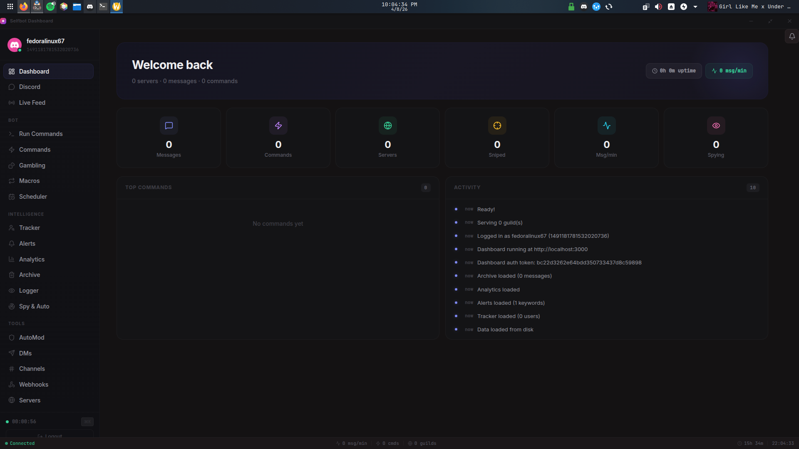
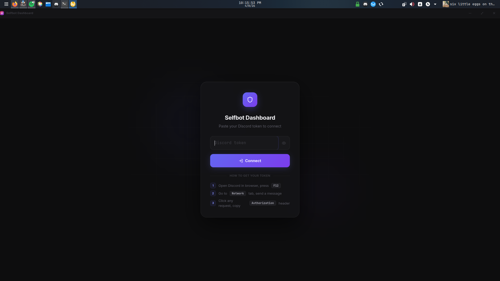
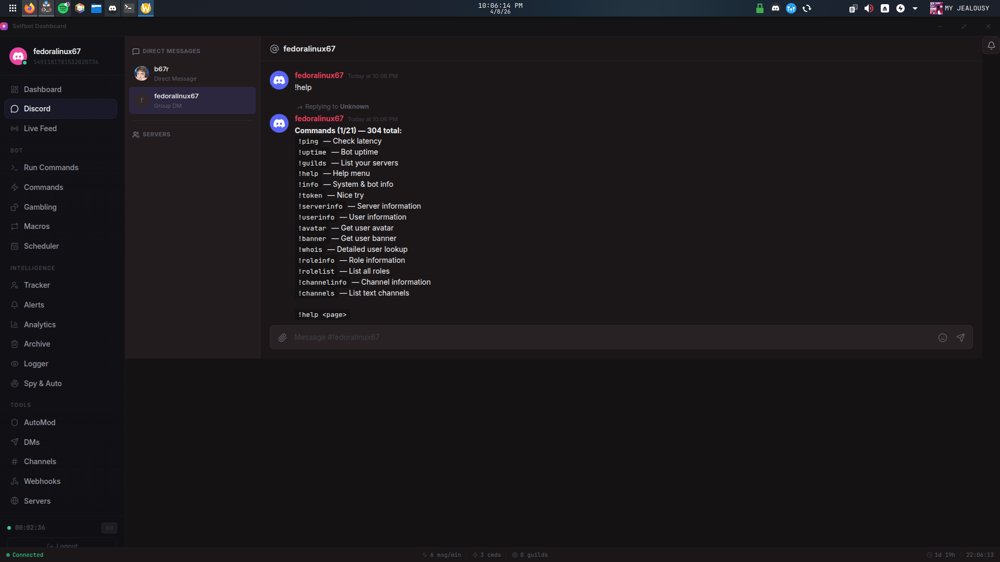
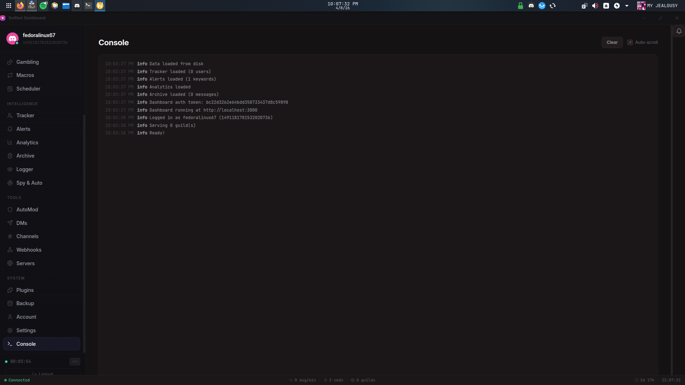
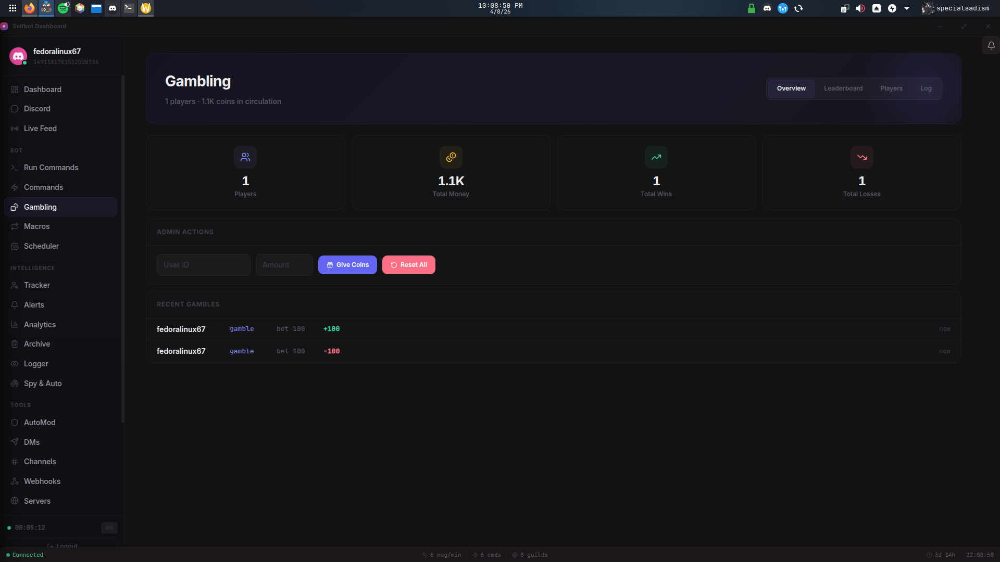
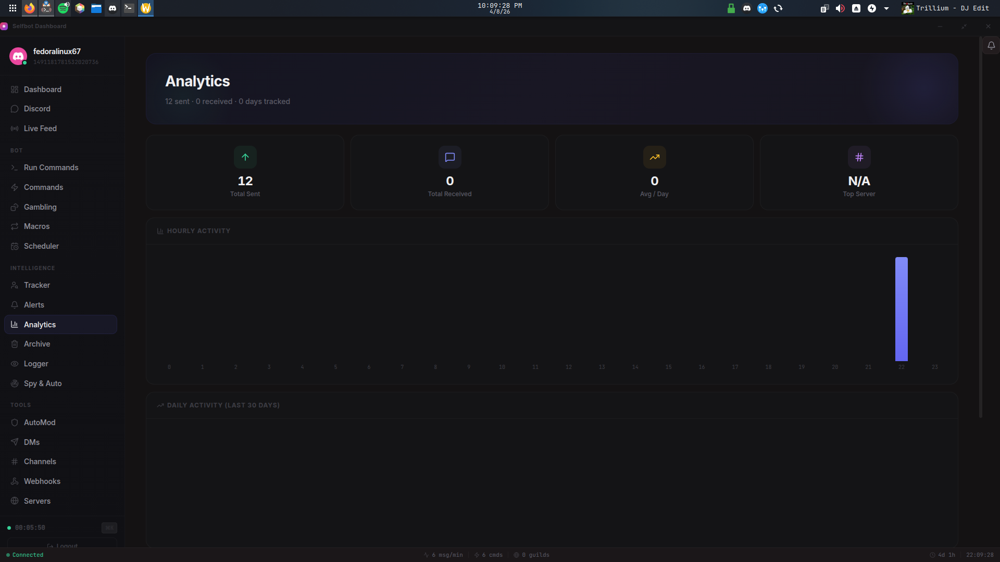
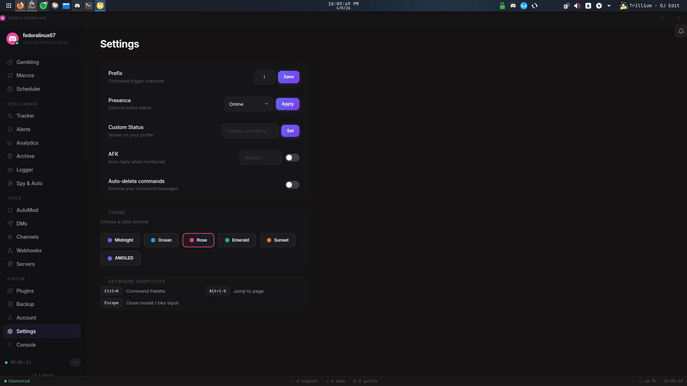

<p align="center">
  
  
  
  
</p>

<h1 align="center">Selfbot Dashboard</h1>

<p align="center">
  A feature-packed Discord selfbot with <b>304 commands</b>, a beautiful <b>React web dashboard</b>, and a native <b>Electron desktop app</b>.
</p>

<p align="center">
  
</p>

---

## Screenshots

<table>
  <tr>
    <td></td>
    <td></td>
  </tr>
  <tr>
    <td></td>
    <td></td>
  </tr>
  <tr>
    <td></td>
    <td></td>
  </tr>
</table>

---

## Features

### 304 Bot Commands

| Category | Count | Highlights |
|----------|-------|------------|
| **Economy & Gambling** | 30 | Blackjack, roulette, crash, slots, horse racing, fishing, mining, daily/work |
| **Text Transforms** | 25 | Morse, binary, zalgo, uwu, fancy unicode, vaporwave, pig latin, gradient |
| **Server Management** | 20 | Kick, ban, timeout, roles, channels, audit logs, prune, lockdown |
| **Profile** | 16 | Set avatar/banner/bio/pronouns, copy profiles, HypeSquad |
| **Friends** | 12 | Add/remove/block, nicknames, notes, friend invites |
| **Messages** | 15 | Forward, crosspost, pin, threads, super reactions, mass forward |
| **Fun & Games** | 25 | Trivia, riddles, would-you-rather, hangman, battle, heist, fortune |
| **Automation** | 15 | Macros, scheduler, auto-reply, auto-delete, keyword alerts |
| **AI Chat** | 5 | Ask questions, translate, summarize, explain, code generation |
| **Utility** | 25 | Snowflake decoder, permissions, member export, server stats |
| **Group DM** | 8 | Create, manage, rename, transfer ownership |
| **And more...** | 100+ | Over 300 commands total |

### 24-Page Dashboard

| Page | Description |
|------|-------------|
| **Overview** | Real-time stats, top commands, activity feed |
| **Discord** | Full Discord client — browse servers, DMs, send messages, emoji, file upload |
| **Terminal** | Run bot commands directly from the dashboard |
| **Live Feed** | Real-time command I/O stream |
| **Commands** | View, search, and toggle all 304 commands |
| **Gambling** | Economy overview, leaderboard, player management |
| **Tracker** | Monitor when users go online/offline, status changes |
| **Alerts** | Keyword notifications with auto-react/reply/forward |
| **Analytics** | Hourly/daily charts, top users, word cloud |
| **Archive** | Persistent deleted message vault with search |
| **Macros** | Create and run command sequences |
| **Scheduler** | Schedule messages with recurring support |
| **AutoMod** | Banned words, anti-spam, anti-link |
| **Spy & Auto** | Monitor users, auto-reply rules |
| **DMs** | Send DMs, browse friends list |
| **Channels** | Browse and message any channel |
| **Webhooks** | Send webhook messages |
| **Servers** | Server list with management |
| **Plugins** | Hot-reloadable plugin system |
| **Backup** | Export/import all data, server backup |
| **Account** | Profile info, quick actions |
| **Settings** | Prefix, presence, themes, keyboard shortcuts |
| **Console** | Live log viewer |

### Desktop App

- **Electron** with custom frameless title bar
- Minimize to **system tray**
- Single instance lock
- **6 color themes** — Midnight, Ocean, Rose, Emerald, Sunset, AMOLED
- **Command palette** (`Ctrl+K`) for quick navigation
- **Keyboard shortcuts** (`Alt+1-9` to jump between pages)
- **Desktop notifications** with sound alerts
- Builds to `.AppImage` (Linux) and `.exe` (Windows)

### Nitro Sniper

Automatically detects and claims Discord Nitro gift links (`discord.gift/...`) in real-time across all servers and DMs.

- **Instant detection** — scans every message for gift links the moment they're sent
- **Auto-claim** — attempts to redeem the gift on your account within milliseconds
- **Full logging** — every attempt is logged with status (claimed / already claimed / failed), who sent it, which channel, and timestamp
- **Dashboard control** — toggle on/off from the dashboard or with `!nitrosniper` command
- **Live notifications** — get a desktop notification + sound alert when a gift is detected
- **History** — view all past claims and attempts from the Nitro section in the dashboard API

> The sniper runs passively in the background. It doesn't spam or abuse any API — it simply reacts faster than humanly possible when a gift link appears.

### Under the Hood

- **Persistent data** — economy, settings, alerts, analytics survive restarts
- **Token-based auth** — dashboard is password-protected
- **Plugin system** — drop `.js` files in `plugins/` for custom commands
- **Nitro sniper** — auto-detect and claim gift links
- **Message archive** — every deleted message saved to disk
- **Multi-account** — switch between Discord tokens from the dashboard

---

## Quick Start

```bash
# Clone
git clone https://github.com/CuteAnimeGirl1337/selfbot.git
cd selfbot

# Install
npm install
cd frontend && npm install && cd ..

# Configure
cp .env.example .env
# Edit .env and add your Discord token

# Build frontend
cd frontend && npx vite build && cd ..

# Run
node index.js
```

Open **http://localhost:3000** — enter your Discord token on first launch.

---

## Desktop App

```bash
# Run
npx electron .

# Build distributable
npm run build-linux    # .AppImage for Linux
npm run build-win      # .exe for Windows
```

---

## Auto-Start (Linux)

```bash
chmod +x install-service.sh
./install-service.sh
# Check status: sudo systemctl status selfbot
```

---

## Docker

```bash
docker build -t selfbot .
docker run -d -p 3000:3000 --env-file .env selfbot
```

---

## Environment Variables

| Variable | Required | Description |
|----------|----------|-------------|
| `TOKEN` | Yes | Discord user token (or set via dashboard) |
| `PORT` | No | Dashboard port (default: `3000`) |
| `GROQ_API_KEY` | No | Enables AI commands (`!ask`, `!translate`, etc.) |

---

## Plugins

Create a `.js` file in the `plugins/` directory:

```js
module.exports = {
  name: 'hello',
  description: 'Says hello',
  execute(message, args, client, stats) {
    message.reply('Hello from a plugin!');
  }
};
```

Reload plugins from the dashboard without restarting.

---

## Project Structure

```
selfbot/
├── index.js              # Entry point
├── bot.js                # 304 commands (4300+ lines)
├── server.js             # Express + WebSocket + REST API
├── stats.js              # Economy system + stats tracker
├── format.js             # Discord message formatter
├── persist.js            # JSON file persistence
├── auth.js               # Dashboard authentication
├── token.js              # Token manager (login/logout)
├── accounts.js           # Multi-account support
├── macros.js             # Command macros
├── scheduler.js          # Message scheduler
├── automod.js            # Auto-moderation engine
├── plugins.js            # Plugin loader
├── nitro.js              # Nitro gift sniper
├── tracker.js            # User activity tracker
├── alerts.js             # Keyword alert system
├── analytics.js          # Message analytics
├── archive.js            # Deleted message archive
├── electron/             # Electron desktop app
│   ├── main.js
│   └── preload.js
├── frontend/             # React + Vite + Tailwind
│   └── src/
│       ├── pages/        # 24 page components
│       ├── components/   # Sidebar, TitleBar, Toast, CommandPalette, etc.
│       └── hooks/        # useSocket, useTheme, useNotifications, useKeyboard
├── plugins/              # Custom command plugins
├── selfbot.service       # Systemd service file
└── Dockerfile            # Container deployment
```

---

## Disclaimer

> Using selfbots violates Discord's Terms of Service and may result in account termination. This project is for **educational purposes only**. Use at your own risk.

---

<p align="center">
  Built with Node.js, React, Electron, and discord.js-selfbot-v13
</p>
